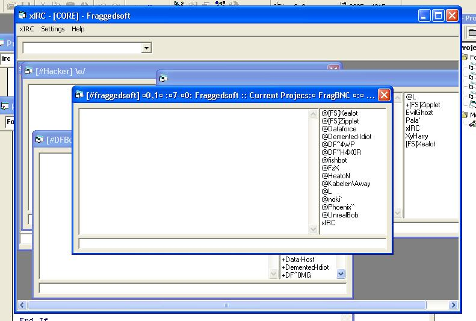



## How to create mIRC like windows

### Description

This article will show you how to make unlimited windows out of 1, think of mIRC.. you think he made all 30 windows manual? no he made like this, a template window then created 30 more of it the same way as this tutorial will show you.
 
### More Info
 

             |
---                |---
**Submitted On**   |
**By**             |[Martin Engström](https://github.com/Planet-Source-Code/PSCIndex/blob/master/ByAuthor/martin-engstr-m.md)
**Level**          |Intermediate
**User Rating**    |4.0 (12 globes from 3 users)
**Compatibility**  |VB 6\.0
**Category**       |[VB function enhancement](https://github.com/Planet-Source-Code/PSCIndex/blob/master/ByCategory/vb-function-enhancement__1-25.md)
**World**          |[Visual Basic](https://github.com/Planet-Source-Code/PSCIndex/blob/master/ByWorld/visual-basic.md)
**Archive File**   |

### Source Code

==================================
 
 HOW TODO MIRC LIKE WINDOWS
 
   TUTORIAL BY:
 
   Xealot
 
==================================
 
 
Hi all, now im gonna explain to you how to create
 
unlimited ammount of windows out of 1 form ( a.k.a. template ).
 
Well, to start with this tutorial will require some programming
 
experience by you cause im not gonna explain everything i.e.
 
what a TYPE (inside a module) is or what variables is =/ ..
 
u have to find tutorials for that elsewhere...
 
 
Basicly what u need to know is how to create forms,
 
modules and how to type :P
 
But if you wanna understand the code, u might need to learn
 
what a TYPE is inside a module aswell.. and ** IMPORTANT **
what an ARRAY is!! ( this thing is basicly based on an array )
 
 
Lets start, theoreticly you index an form.. ( i hope you know how to index a control ).
 
Like you know you can make Text1(1).text .. thats an indexed
 
Text1.. and im calling the #1 .. it works the same as an array.
 
We are going to do the same to a form BUT .. as you may have noticed..
 
( if you take a look at the properties window ) theres nothing called
 
"Index" on form..
 
 
So this is a bit weird, create an module and inside type like:
 
 
public type Xealot
 
q as new form1
 
end type
 
public io(1 to 5) as xealot
 
 
Ok let me explain what this code does..
 
Say you have made a FORM called Form1.. ( this is the form we wish to make loads of ).
 
this piece of code will make an TYPE as we call "xealot" << it doesnt matter what you call it.
 
inside types, as you may know.. you can DIM variables.. except you dont type public/dim ..
 
we DIM an variable called q as a new Form1..
this means you create a new copy of Form1..
 
a bit strange.. basicly it creates a new window that looks like Form1.. also executes
 
same code as in Form 1.
 
 
public io(1 to 5) as xealot
 
 
that will make an public variable called io ... it has an array from 1 to 5..
 
the number 1 to 5 means we will create 5 windows of Form1.. ( change the number if you wish ).
 
now.. its *kinda* done.. make a Form2 and goto project properties and set Form2 as the startup form.
 
Inside form2 make an button (commmand) and its code would be:
 
 
for n = 1 to 5
 
io(n).q.show
 
next
 
 
DONE! this would make so when you press command1 << the button,.. 5 windows that looks like Form1
 
should appear :D ... have fun..
 
oh yes and .. a small trick like saving info as "This copy of Form1 is number 4 thats created" is simple..
 
You ever wondered what the propertie "tag" is in a form? its basicly
 
an variable for u to put nonsense in.. you can store stuff in there.
 
 
Lets experiment with it, shall we?
 
Ok lets edit the command1's code in Form2 to:
 
 
for n = 1 to 5
 
io(n).q.show
 
io(n).q.tag = trim$(str$(n))
 
next
 
 
then lets have fun with Form1, make an button..
 
inside the code (command1) type:
 
 
msgbox(me.tag)
 
 
This should look like, say you press the button on the 3'rd form thats created,
 
you should get a msgbox saying "3" :)
 
 
Thats not too hard was it?
 
ah well.. have fun!
 
 
[  [ Xealot ]   ]
 
[ littlebrainbug@hotmail.com ]
 
[ #Fraggedsoft @ Quakenet ]
 

